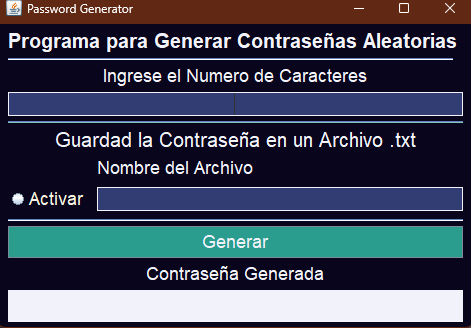

# Generador de Contraseñas en Java

Este proyecto es un generador de contraseñas aleatorias implementado en Java con una interfaz de usuario amigable. Permite generar contraseñas aleatorias y guardarlas en un archivo de texto.

## Características

- **Generación de contraseñas**: El programa puede generar contraseñas aleatorias.
- **Guardado de contraseñas**: El programa puede guardar las contraseñas generadas en un archivo de texto para su posterior uso.
- **Interfaz de usuario**: El programa cuenta con una interfaz de usuario intuitiva para facilitar la interacción.

## Estructura del Proyecto

El proyecto consta de los siguientes archivos:

- `password_generator.java` : Este es el archivo principal que contiene todo el código del generador de contraseñas.
- `password_generator.form`: Este archivo contiene la descripción de la interfaz de usuario en un formato que puede ser utilizado por el IDE para construir la interfaz gráfica.

## Requisitos

Para ejecutar este programa, necesitarás tener Java y un IDE compatible con archivos `.form` (como IntelliJ IDEA) instalado en tu sistema. Puedes descargar Java desde la página oficial de Java.

## Licencia

Este proyecto está bajo la licencia MIT. Consulta el archivo `LICENSE` para obtener más detalles.

---------------------------------------

# Password Generator in Java

This project is a random password generator implemented in Java with a user-friendly interface. It allows you to generate random passwords and save them in a text file.

## Features

- **Password generation**: The program can generate random passwords.
- **Password saving**: The program can save the generated passwords in a text file for later use.
- **User interface**: The program has an intuitive user interface to facilitate interaction.

## Project Structure

The project consists of the following files:

- `password_generator.java` : This is the main file that contains all the code for the password generator.
- `password_generator.form`: This file contains the description of the user interface in a format that can be used by the IDE to build the graphical interface.

## Requirements

To run this program, you will need to have Java and an IDE compatible with `.form` files (like IntelliJ IDEA) installed on your system. You can download Java from the official Java page.

## License

This project is under the MIT license. Check the `LICENSE` file for more details.

-----------------------------------------

 

